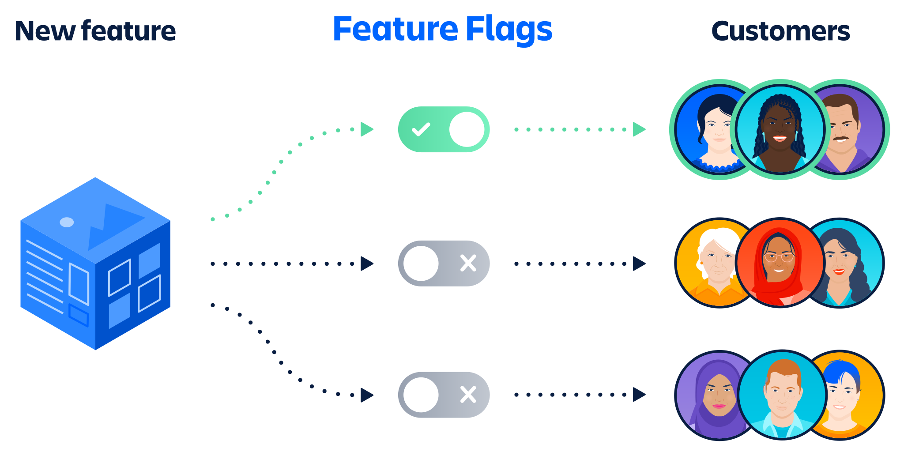

# Feature Flags

Safely roll out features to specific users or groups

Test changes with small groups of users before rolling out wider. Analyze usage with product analytics and session replay.

## Setup

### Using flags in SvelteKit

> [!TIP]
> Learn the best practices for creating feature flags in SvelteKit by using the @vercel/flags/sveltekit package, follow [SvelteKit Guide](https://vercel.com/docs/workflow-collaboration/feature-flags/flags-pattern-sveltekit)

### Available flags

All of these are communicated through the `/.well-known/vercel/flags` endpoint, which is set up automatically by the createHandle call we made in `hooks.server.ts`.

> [!NOTE]
> This hook intercepts all requests and responds with the application's feature flags when it sees the authenticated request made by Vercel Toolbar to load your application's feature flags.

## Reference

1. [Flags Architectural Patterns](https://vercel.com/docs/workflow-collaboration/feature-flags/feature-flags-pattern)
2. [Vercel Feature Flags](https://vercel.com/docs/workflow-collaboration/feature-flags)
3. [Vercel Toolbar](https://vercel.com/docs/workflow-collaboration/vercel-toolbar)
