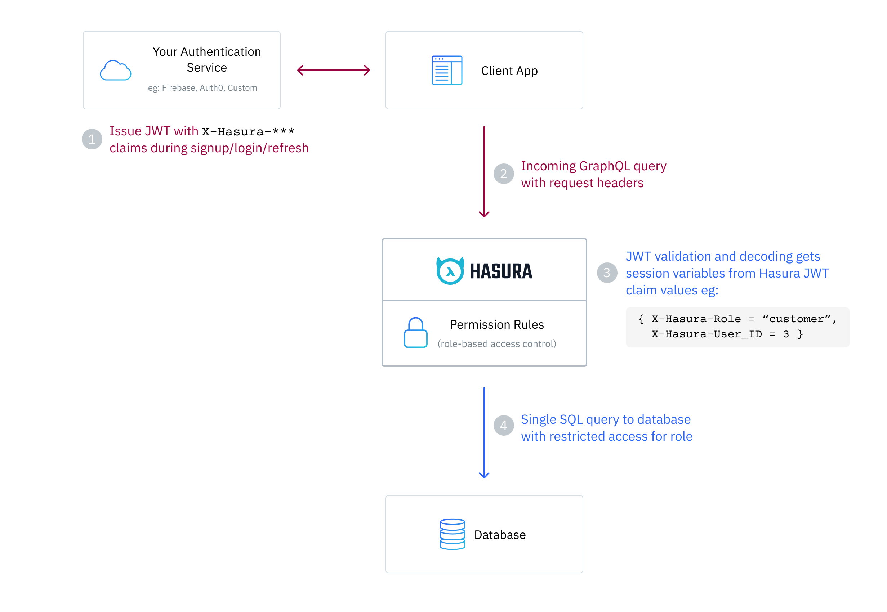

# Hasura Auth

We are using [hasure-auth](https://docs.nhost.io/guides/auth/overview) as **Identity Broker** which use _Identry Providers_ (IDPs) such as _Google_, _AzureAD_, _GitHub_ etc for login/SSO and issue _Hasura_ friendly JWT _accessToken_, _refreshToken_ and optionally _Personal Access Tokens_ (PAT) to use as `bearer` token with backend services.



## Authentication (AuthN)

### Human Accounts

Users login from WebApp form with `username/password` or Social Login (e.g., Google, AzureAD, GitHub etc), then `hasura-auth` issue JWT Session token.  
JWT token issued during `SignIn` step is used as `Session` token to access backend services during user session. JWT `Session` tokens has short lifetime.

Users can `SugnUp` via **WebApp** to a specific `organization` with an email in `allowed email domains` or `allowed emails` defined in `public.organizations` for that `organization`.  
They will automatically get _allowed roles_ defined in `AUTH_USER_DEFAULT_ALLOWED_ROLES` i.e., `user,me` and _default role_ defined in `AUTH_USER_DEFAULT_ROLE` i.e., `user`

Optionally, additional higher roles can be added to user's _allowed roles_ by administrator (manager) by [Deligation](#Deligation) UI.

### Service Accounts

We create Service Account (with role: device) when a new device is provisioned and generate PAT token.  
**PAT** token (secret) issued during `SignUp` step is used as `API_KEY` to access backend services. _PATs_ have longer lifetime.

## Authorization (AuthZ)

## Roles

Every table or view can have permission rules defined for users based on user **role**. You define your own
roles in the Hasura GraphQL Engine and then create permissions for each of them.

Recommended roles:

- **Users**: users who are using the application as a starting point for their work.
- **Supervisors**: users who are mainly using the application to manage users and their access of their _organization_.
- **Administrators**: this users are able to grant additional organizations or departments and elect supervisors.

| Role       | Description                                                            | Allowed Activity                                                                   |
| ---------- | ---------------------------------------------------------------------- | ---------------------------------------------------------------------------------- |
| anonymous  | A user who is not logged-in                                            | Only read from some restricted tables/views or public data                         |
| user       | A user who is logged in                                                | Allow access to personally created data and any public data                        |
| me         | A user who is logged in                                                | Allow access to personally created data                                            |
| supervisor | A user that has access to other users' data with in their organization | Allow access to personally created data, their organization's data and public data |
| manager    | A user that has access to any users' data across all organizations     | Allow access to all users' data and public data                                    |

See [this section](https://hasura.io/docs/latest/auth/authorization/permissions/) on how to configure permissions.

> Note: Roles are meant for internal business logic and therefore need to be defined per application. User's `Groups` provided by tenant or IDP can be used to derive `Roles` for User.

By default, users have two allowed roles:

- user (default)
- me

> If users have more elevated roles, UI can pass elevated role in http header e.g., `X-Hasura-Role: supervisor` to run specific operation with that role. If this header is not present, the operation will run with default role i.e., `user`.

### The Admin Role

By default, there is an `admin` role that can perform any operation on any table.
For our case `admin` is only used for back channel management app.
For customer facing apps we use `anonymous`, `user`, `me`, `supervisor`, `manager` roles.

### Assign Allowed Roles

It’s possible to give users a subset of allowed roles during SignUp.

**Example:** Save `supervisor` role (in addition to standard `user`, `me` roles) to the user’s allowed roles during SignUp:

```js
await nhost.auth.signUp({
  email: 'joe@example.com',
  password: 'secret-password'
  options: {
    allowedRoles: ['user','me','supervisor']
  }
})
```

### Set Role for GraphQL Requests

When no role is specified, the user’s default role will be used:

```js
await nhost.graphql.request(QUERY, {});
```

If you want to make a GraphQL request using a specific role from `allowedRoles`, you can do so by using the `x-hasura-role` header, like this:

```js
await nhost.graphql.request(
	QUERY,
	{},
	{
		headers: {
			'x-hasura-role': 'me',
		},
	},
);
```

### Permissions

| Role       | Action | Permissions                                                                                                                             |
| ---------- | ------ | --------------------------------------------------------------------------------------------------------------------------------------- |
| user       | select | {"\_and":[{"deleted_at":{"_is_null":true}},{"organization":{"_in":"x-hasura-allowed-orgs"}},{"created_by":{"_eq":"x-hasura-user-id"}}]} |
| manage     | select | {"\_and":[{"deleted_at":{"_is_null":true}},{"organization":{"_in":"x-hasura-allowed-orgs"}}]}                                           |
| supervisor | select | {"\_and":[{"deleted_at":{"_is_null":true}},{"organization":{"_eq":"x-hasura-default-org"}}]}                                            |
| user       | update | {"\_and":[{"deleted_at":{"_is_null":true}},{"organization":{"_in":"x-hasura-allowed-orgs"}},{"created_by":{"_eq":"x-hasura-user-id"}}]} |
| manage     | update | {"\_and":[{"deleted_at":{"_is_null":true}},{"organization":{"_in":"x-hasura-allowed-orgs"}}]}                                           |
| supervisor | update | {"\_and":[{"deleted_at":{"_is_null":true}},{"organization":{"_eq":"x-hasura-default-org"}}]}                                            |

> `delete` action is desable for most cases, as we do `soft-delete`

## Organizations

Generally a user belongs to and is managed by one organization, however the user can receive authorizations from multiple other organizations (delegated authorizations).
Anyways, a user should be able to use the same identity to switch between organizations.

When use `SignUp`, the system will assgin **default** `Organization` in metadata field in `Users` table. Same way allowed `Roles` also be assigned during `SignUp`.  
Custom UI dashboard can be used to assign/unassign `Orgs` to `Users` by `Administrators` after user account is created. This data is stored in `public.user_org` table.

### Deligation

**Deligation** is the process where higher role users can assign elevated roles (supervisor, manager) to other users via custom UI with in his/her default `Organization` or diffrent `Organization` with in multi-tenant deployment.

> **Assumptions:** there will be `public.user_roles_orgs` table that manage `user-role` assignment for a give `Organization`

#### Types of Deligation

1. An administrator (with `manager` role) can add additional higher roles to existing user's `allowed_roles` in the same user's `default_org` and set it as user's `default_role`.
   e.g., Administrator can promote a regular `user` role up to `supervisor` role with in the user's **default_org**, 1. by setting user's `default_role` as `supervisor` in `auth.users` table and 2. by adding `supervisor` role to `auth.user_roles` table. A databse trigger should also insert corresponding rows in `public.user_roles_orgs` with user's `default_org`.
2. An administrator (with `manager` role) can also assign a role (up to `supervisor`) to existing user to **other** `Organizations` in `public.user_roles_orgs` table and set user's `allowed_roles` and `default_role` flag with that new `Organization` in `public.user_roles_orgs` table.
3. To assign `manager` role to an user, set `default_role` as `manager` in `auth.users` and add `manager` role for that user in `auth.user_roles` table.
   > Admin users will have exactly one `manager` role defined as `default_role` in their `default_org` in `auth.users` table.

## Reference

- [Authentication and authorization in multi-tenancy B2B scenarios](https://zitadel.com/docs/guides/solution-scenarios/b2b)
- [user management in nhost](https://docs.nhost.io/guides/auth/users)
- [Hasura Authentication Using JWTs](https://hasura.io/docs/latest/auth/authentication/jwt/)
