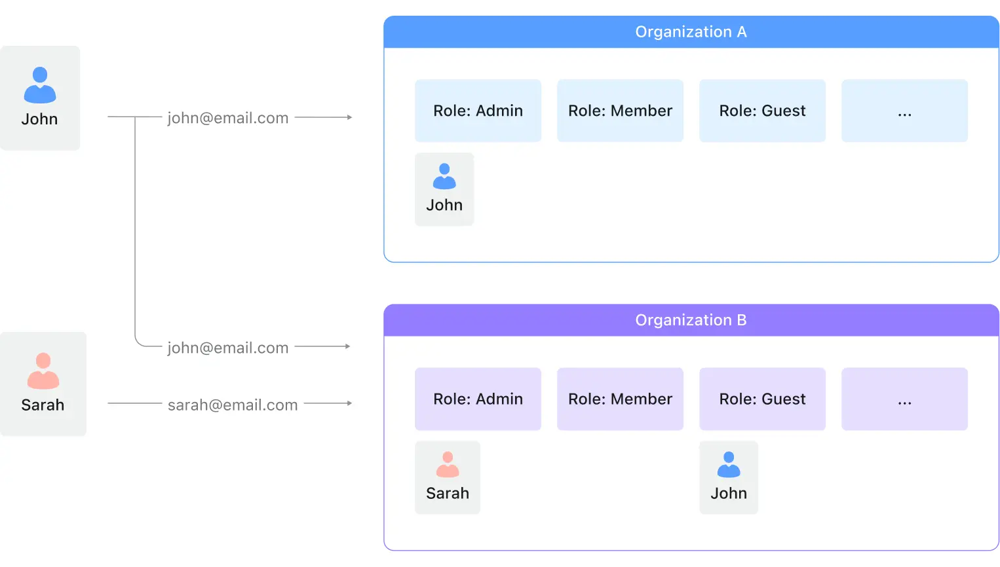

# Hasura Auth

We are using [hasure-auth](https://docs.nhost.io/guides/auth/overview) as **Identity Broker** which use _Identry Providers_ (IDPs) such as _Google_, _AzureAD_, _GitHub_ etc for login/SSO and issue _Hasura_ friendly JWT _accessToken_, _refreshToken_ and optionally _Personal Access Tokens_ (PAT) to use as `bearer` token with backend services.


## Authentication (AuthN)

### Human Accounts

Users login from WebApp form with `username/password` or Social Login (e.g., Google, AzureAD, GitHub etc), then `hasura-auth` issue JWT Session token.  
JWT token issued during `SignIn` step is used as `Session` token to access backend services during user session. JWT `Session` tokens has short lifetime.

Users can `SugnUp` via **WebApp** to a specific `organization` with an email in `allowed email domains` or `allowed emails` defined in `public.organizations` for that `organization`.  
They will automatically get _allowed roles_ defined in `AUTH_USER_DEFAULT_ALLOWED_ROLES` i.e., `user,me` and _default role_ defined in `AUTH_USER_DEFAULT_ROLE` i.e., `user`

Optionally, additional higher roles can be added to user's _allowed roles_ by administrator (manager) by [Deligation](#deligation) UI.

### Service Accounts

We create Service Account (with role: device) when a new device is provisioned and generate PAT token.  
**PAT** token (secret) issued during `SignUp` step is used as `API_KEY` to access backend services. _PATs_ have longer lifetime.

## Authorization (AuthZ)

## Roles

Every table or view can have permission rules defined for users based on user **role**. You define your own
roles in the Hasura GraphQL Engine and then create permissions for each of them.

Recommended roles:

- **Users**: users who are using the application as a starting point for their work.
- **Supervisors**: users who are mainly using the application to manage users and their access of their _organization_.
- **Administrators**: this users are able to grant additional organizations or departments and elect supervisors.

| Role       | Description                                                            | Allowed Activity                                                                   |
| ---------- | ---------------------------------------------------------------------- | ---------------------------------------------------------------------------------- |
| public  | A user who is not logged-in                                            | Only read from some restricted tables/views or **public** data                     |
| user       | A user who is logged in                                                | Allow access to personally created data and any **public** data                    |
| me         | A user who is logged in                                                | Allow access to personally created data and any **private** data                   |
| supervisor | A user that has access to other users' data with in their organization | Allow access to personally created data, their organization's data and public data |
| manager    | A user that has access to any users' data across all organizations     | Allow access to all users' data and public data                                    |

See [this section](https://hasura.io/docs/latest/auth/authorization/permissions/) on how to configure permissions.

> Note: Roles are meant for internal business logic and therefore need to be defined per application. User's `Groups` provided by tenant or IDP can be used to derive `Roles` for User.

By default, users have two allowed roles:

- user (default)
- me

> If users have more elevated roles, UI can pass elevated role in http header e.g., `X-Hasura-Role: supervisor` to run specific operation with that role. If this header is not present, the operation will run with default role i.e., `user`.

### Role Hierarchy

Cascading permissions with inherited roles

```yaml
- role_name: user
  role_set:
    - public # anonymous
- role_name: me
  role_set:
    - user
    - private
- role_name: supervisor
  role_set:
    - user
- role_name: manager
  role_set:
    - supervisor
```

### The Admin Role

By default, there is an `admin` role that can perform any operation on any table.
For our case `admin` is only used for back channel management app.
For customer facing apps we use `public`, `user`, `me`, `supervisor`, `manager` roles.

### Assign Allowed Roles

It’s possible to give users a subset of allowed roles during SignUp.

**Example:** Save `supervisor` role (in addition to standard `user`, `me` roles) to the user’s allowed roles during SignUp:

```js
await nhost.auth.signUp({
  email: 'joe@example.com',
  password: 'secret-password'
  options: {
    allowedRoles: ['user','me','supervisor']
  }
})
```

### Set Role for GraphQL Requests

When no role is specified, the user’s default role will be used:

```js
await nhost.graphql.request(QUERY, {});
```

If you want to make a GraphQL request using a specific role from `allowedRoles`, you can do so by using the `x-hasura-role` header, like this:

```js
await nhost.graphql.request(
  QUERY,
  {},
  {
    headers: {
      'x-hasura-role': 'me',
    },
  },
);
```

### Permissions

| Role       | Action | Permissions                                                                                                                             |
| ---------- | ------ | --------------------------------------------------------------------------------------------------------------------------------------- |
| user       | select | {"_and":[{"deleted_at":{"_is_null":true}},{"organization":{"_in":"x-hasura-allowed-orgs"}},{"created_by":{"_eq":"x-hasura-user-id"}}]} |
| manage     | select | {"_and":[{"deleted_at":{"_is_null":true}},{"organization":{"_in":"x-hasura-allowed-orgs"}}]}                                           |
| supervisor | select | {"_and":[{"deleted_at":{"_is_null":true}},{"organization":{"_eq":"x-hasura-default-org"}}]}                                            |
| user       | update | {"_and":[{"deleted_at":{"_is_null":true}},{"organization":{"_in":"x-hasura-allowed-orgs"}},{"created_by":{"_eq":"x-hasura-user-id"}}]} |
| manage     | update | {"_and":[{"deleted_at":{"_is_null":true}},{"organization":{"_in":"x-hasura-allowed-orgs"}}]}                                           |
| supervisor | update | {"_and":[{"deleted_at":{"_is_null":true}},{"organization":{"_eq":"x-hasura-default-org"}}]}                                            |

> `delete` action is desable for most cases, as we do `soft-delete`

## Organizations

Generally a user belongs to and is managed by one _organization_, however the user can receive invitation to join multiple _organizations_ by respective `org:owner`s.  
Anyways, a user should be able to use the same identity(JWT) to switch between _organizations_ with-in the _Application_.

An user who has the membership of an organization is referred to as an organization member (i.e. member) within that organization's context.


Some users may be belongs to more then one _organization_. this is called **multi-tenancy**. such users may have different _Roles_ in different _Organizations_

Let’s take an example to understand how everything connects:

**John, Sarah** are in different organizations with different roles in the context of different organizations.



From this diagram, here are some info you need to know:

1. **John** is affiliated with two organizations, using the email `john@email.com` as his unique identifier. He holds the position of `admin` in `Organization A` and is a `guest` in `Organization B`.
2. **Sarah** is associated with a single organization and uses the email `sarah@email.com` as her unique identifier. She is the `admin` of `Organization B`.
3. The roles of `Admin`, `Member`, and `Guest` are designated within organizations and these roles are consistent across various organizations.
4. Additional roles can be created within the `sys:admin`'s` UI. These newly created roles will be applied and shared across all organizations.

### Actions

1. **Organizations** are created by `sys:admin` ahead-of-time, and a pre-registered `user` is assign as `org:owner` of that _organization_ by `sys:admin`
   1. `sys:admin` should be able to create new **organizations** ahead with Org: `display_name`,  `description` `allowed_email_domains`  `allowed_emails`,  `blocked_email_domains` `blocked_emails` `plan` etc via Web UI.
2. When user `SignUp`, they may not belongs to any _organization_, unless their email is already invited to join an _organization_ by its `org:admin`. If user don't have an Org, they can only manage their `profile` page in the UI app.
3. `org:owner` and `org:admin` of an _organization_ can invite any pre-registered or un-registered users to join their _organization_ by inviting via Web UI.
   1. Users are invited with one of the roles: `org:member` or  `org:admin`  or  `org:billing` etc. NOT `org:owner`
   2. An organization can have only one owner, and ownership can be transferred.
4. `sys:admin` can have a Custom UI to assign/unassign _Organizations_ to _Users_ in bulk. This data is stored in `public.user_org_roles` table.

### Org Permissions

| Action                                                        | Billing | Member | Admin | Manager | Owner |
| ------------------------------------------------------------- | ------- | ------ | ----- | ------- | ----- |
| Can see and edit billing information and subscription details | ✓       |        |       |         | ✓     |
| Can see and edit legal and compliance details                 | ✓       |        |       |         | ✓     |
| Can view and act on issues (such as assigning and resolving)  |         | ✓      | ✓     | ✓       | ✓     |
| Can join and leave existing teams                             |         | ✓      | ✓     | ✓       | ✓     |
| Can add repositories (through GitHub integrations)            |         | ✓      | ✓     | ✓       | ✓     |
| Can create and remove teams from the organization             |         |        | ✓     | ✓       | ✓     |
| Can change project settings                                   |         | ✓*     | ✓     | ✓       | ✓     |
| Can create and remove projects for the organization           |         | ✓**    | ✓     | ✓       | ✓     |
| Can edit Global Integrations                                  |         |        | ✓     | ✓       | ✓     |
| Can remove repositories                                       |         |        | ✓     | ✓       | ✓     |
| Can add, remove, and change Org Members                       |         |        |       | ✓       | ✓     |
| Can change organization settings, including open membership   |         |        |       | ✓       | ✓     |
| Can assign Team Admin role                                    |         |        |       | ✓       | ✓     |
| Can add, remove, and edit Team Contributors                   |         |        |       | ✓       | ✓     |
| Can add projects for teams                                    |         |        |       | ✓       | ✓     |
| Can remove projects from teams                                |         |        |       | ✓       | ✓     |
| Can transfer projects to another organization                 |         |        |       |         | ✓     |
| Can remove an organization                                    |         |        |       |         | ✓     |

### Actions (old)

1. **Anonymous** (`public` role) user should be able to self register account as long as their email domain is in the allowed email domains (`AUTH_ACCESS_CONTROL_ALLOWED_EMAIL_DOMAINS`) and not in blacklist(`AUTH_ACCESS_CONTROL_BLOCKED_EMAILS`) for a give `Organization`. Checks are handled by `hadura-auth` for home-org.
   1. This should result creating row in `auth.users` table with with `default_org=AUTH_USER_DEFAULT_ROLE` and multiple rows added in `auth.user_roles` matching to `AUTH_USER_DEFAULT_ALLOWED_ROLES` _automatically_.
   2. This should result creating multiple rows  _automatically_ in  `public.user_org_roles` table with one of the row having `is_default_role=true` that match to `auth.user.default_role` via _trigger_.
2. **User** should be able switch the `default_org` and `default_role` for home/non-home `orgs` applied only during that user **session**.
3. **Administrator** should be able **ADD** new  **non-home** `orgs` and assciated `allowed_roles` for **any** selected user and set  `is_default_role` in `public.user_org_roles`.
4. **Administrator** should be able **REMOVE** existing  **non-home** `orgs` and assciated `allowed_roles` for **any** selected user in  `public.user_org_roles` for `non-home` org.
5. **Administrator** should be able update **any** user's default role in `public.user_org_roles` for `non-home` orgs. This should change `is_default_role` appropriately by **trigger**.
6. Similarly **Administrator** should **ADD** / **REMOVE** roles in **home** `org` by add/remove roles in `auth.user_roles` table and set **home** org's `default_role`  in `auth.users` table.

### Deligation

**Deligation** is the process where higher role users can assign elevated roles (supervisor, manager) to other users via custom UI with in his/her default `Organization` or diffrent `Organization` with in multi-tenant deployment.

> **Assumptions:** there will be `public.user_roles_orgs` table that manage `user-role` assignment for a give `Organization`

#### Types of Deligation

1. An administrator (with `manager` role) can add additional higher roles to existing user's `allowed_roles` in the same user's `default_org` and set it as user's `default_role`.
   e.g., Administrator can promote a regular `user` role up to `supervisor` role with in the user's **default_org**, 1. by setting user's `default_role` as `supervisor` in `auth.users` table and 2. by adding `supervisor` role to `auth.user_roles` table. A databse trigger should also insert corresponding rows in `public.user_roles_orgs` with user's `default_org`.
2. An administrator (with `manager` role) can also assign a role (up to `supervisor`) to existing user to **other** `Organizations` in `public.user_roles_orgs` table and set user's `allowed_roles` and `default_role` flag with that new `Organization` in `public.user_roles_orgs` table.
3. To assign `manager` role to an user, set `default_role` as `manager` in `auth.users` and add `manager` role for that user in `auth.user_roles` table.
   > Admin users will have exactly one `manager` role defined as `default_role` in their `default_org` in `auth.users` table.

## FAQ

**How to implement `on-behalf-of` feature in webApps using Hasura?**

In some cases it is necessary to act **on behalf of** a user. While the **Auth** service doesn’t allow that it is not difficult to implement such functionality as a serverless function.  
You can find an example of a function that can generate a valid access token for your application with customized values here: [Custom JWTs](https://docs.nhost.io/guides/auth/custom-jwts)

## Reference

- [Authentication and authorization in multi-tenancy B2B scenarios](https://zitadel.com/docs/guides/solution-scenarios/b2b)
- [user management in nhost](https://docs.nhost.io/guides/auth/users)
- [Hasura Authentication Using JWTs](https://hasura.io/docs/latest/auth/authentication/jwt/)
- [logto: Understand how organizations work](https://docs.logto.io/docs/recipes/organizations/understand-how-it-works/)
