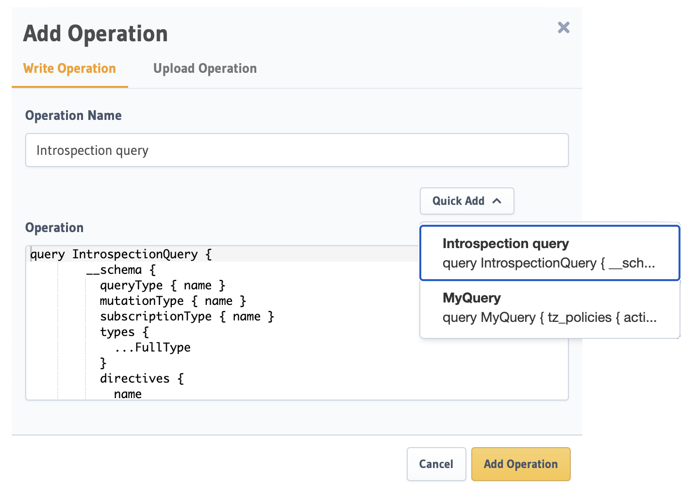

# Hasura

GraphQL APIs with Hasura


## TODO

- [ ] Add **Authentication** and **Object Storage** for Hasura using [Hasura Backend Plus](https://nhost.github.io/hasura-backend-plus/) container

## hasura-cli

### Install

```shell
pnpm add -g hasura-cli
# (OR)
go install github.com/hasura/graphql-engine/cli/cmd/hasura@latest
```

### Usage

NOTE: You can pass `--endpoint <hasura-endpoint> --admin-secret <admin-secret> command-line args for all _Hasura CLI_ commands

```shell
# Create a directory to store migrations (with endpoint and admin secret configured):
# use `''` to escape if `admin-secret` has special characters
hasura init hasura --project infra --endpoint https://twirbianfvhmxhqfjtvi.hasura.us-east-1.nhost.run --admin-secret '<my-admin-secret>'
# from localhost
hasura init hasura --project infra --endpoint http://localhost:8080
# move infra/hasura/config.yaml to project root and edit metadata_directory, migrations_directory, seeds_directory paths in it

hasura version

## open console
hasura console

# Create a new seed by exporting data from tables already present in the database:
hasura seed create devices --database-name default --from-table devices
hasura seed create pools --database-name default --from-table pools
hasura seed create rules --database-name default --from-table rules
hasura seed create policies --database-name default --from-table policies

# Export data from multiple tables:
# hasura seed create policies_organization --database-name default --from-table policies --from-table organization
# Apply only a particular file:
hasura seed apply --file 1684709181893_devices.sql --database-name default
hasura seed apply --file 1684709183467_pools.sql --database-name default
hasura seed apply --file 1685396655834_rules.sql --database-name default
hasura seed apply --file 1684206620559_policies.sql --database-name default

# hasura seed apply --file 1684101975415_policies_organization.sql --database-name default


# To apply all the Migrations present in the `migrations/` directory and the Metadata present in the `metadata/` directory on a new, "fresh",
# instance of the Hasura Server at http://another-server-instance.hasura.app:
hasura deploy --endpoint https://twirbianfvhmxhqfjtvi.hasura.us-east-1.nhost.run  --admin-secret <admin-secret>
# To apply only apply metadata
hasura metadata apply --endpoint https://twirbianfvhmxhqfjtvi.hasura.us-east-1.nhost.run  --admin-secret <admin-secret>
# NOTE:
# if you get error: "permission denied to create extension \"hstore\"", Run `create extension hstore;` in hasura console
# if you get error: "must be owner of extension hstore",  Run `alter role nhost_hasura with superuser;` in hasura console
# if you get error: "x509: certificate signed by unknown authority", add `--insecure-skip-tls-verify` flag to above command

#  Check the status of Migrations
hasura migrate status --database-name default
# Apply the Metadata and Migrations:
hasura migrate apply --database-name default
# then apply seeds
# after applying seeds, then apply metadata
hasura metadata apply
hasura metadata reload
# update local "init" migrate file from server
hasura migrate create  "init" --database-name default --from-server
# rollback/rollup last migrate
hasura migrate apply --down 1
hasura migrate apply --up 1
hasura migrate apply --version 1686378049757 --type down --database-name default
# Export Hasura GraphQL Engine metadata from the database
hasura metadata export
# Show changes between server metadata and the exported metadata file:
hasura metadata diff
# Reload Hasura GraphQL Engine metadata on the database.
hasura metadata reload
# Apply Hasura Metadata
hasura metadata apply
```

## Local Hasura

### Start local Hasura

```shell
docker compose up hasura
# shutdown
docker compose down
# shutdown , reset volume
docker compose down -v
```

### Apply Migrations and Metadata on another instance of the Hasura Server

To apply all the **Metadata** and **Migrations** present in the `infra/hasura` directory to a new, "fresh" database (i.e., after `docker compose down -v`):

> In this case, I am applying metadata, migrations and seed data to local fresh hasura/postgres database started with `docker compose up hasura`

```shell
# only apply metadata
hasura metadata apply --endpoint http://localhost:8080
# apply metadata, DB migrations and seed data
hasura deploy --endpoint http://localhost:8080
hasura seed apply --file 1684709181893_devices.sql --database-name default --database-name default --endpoint http://localhost:8080
hasura seed apply --file 1684709183467_pools.sql --database-name default --database-name default --endpoint http://localhost:8080
hasura seed apply --file 1685396655834_rules.sql --database-name default --database-name default --endpoint http://localhost:8080
hasura seed apply --file 1684206620559_policies.sql --database-name default --database-name default --endpoint http://localhost:8080
```

Check the status

```shell
hasura metadata diff
hasura migrate status --database-name default
```

### Export Metadata

To export **Metadata** and **Migrations** from your local Hasura to `infra/hasura` directory, for sharing with the team:

```shell
hasura metadata export --endpoint http://localhost:8080
```

### Reset Hasura Migrations and Metadata

> useful when you reset your cloud **Postgres** and **Hasura** metadata

#### Step 1: Reset the migration history on the server

```shell
# reset migrations on server only
hasura migrate delete --all --server --database-name default
# Verify the status of the Migrations
hasura migrate status --database-name default
```

#### Step 2: recreate public schema

> via hasura console SQL interface or via postgres CLI

```sql
DROP SCHEMA public CASCADE;
CREATE SCHEMA public;
GRANT ALL ON SCHEMA public TO postgres;
GRANT ALL ON SCHEMA public TO public;
```

#### Step 3: reinitialize metadata and migrations

```shell
# apply metadata, DB migrations
hasura deploy
# optionally apply seeds
hasura seed apply --file 1684709181893_devices.sql --database-name default --database-name default
hasura seed apply --file 1684709183467_pools.sql --database-name default --database-name default
hasura seed apply --file 1685396655834_rules.sql --database-name default --database-name default
hasura seed apply --file 1684206620559_policies.sql --database-name default --database-name default
```

## Configuration

## Gotchas

### Allow List



- **In development instances:** During development or in dev instances, disable the Allow List (default setting) to enable complete access to the GraphQL schema.
  Add/remove operations in the [Allow List](https://hasura.io/docs/latest/security/allow-list/) and then export the Metadata for version-control (so you can apply it to other instances).
- **In CI/CD instances:** Enable the Allow List for testing.
- **In production instances:** Enabling the Allow List is highly recommended when running the GraphQL Engine in production. i.e., `HASURA_GRAPHQL_ENABLE_ALLOWLIST: 'true'`

Use plugin [@graphql-codegen/hasura-allow-list](https://npmjs.com/package/@graphql-codegen/hasura-allow-list) that automates the creation of the "AllowList" based on the GraphQL Queries found in your front-end code.

> [Role-based Allow List](https://hasura.io/docs/latest/security/allow-list/#role-based-allow-list) only available on **Hasura Cloud** or **Hasura Enterprise Edition**

## Reference

- Sample metadata <https://github.com/hasura/template-gallery/tree/main/postgres>-
- Hasura and AuthJS [intigration](https://hasura.io/learn/graphql/hasura-authentication/integrations/nextjs-auth/)
- [Hasura Backend Plus](https://nhost.github.io/hasura-backend-plus/)
- [GraphQL Security in Production with Automated Allow Lists](https://hasura.io/blog/graphql-security-in-production-with-hasura-automated-allow-lists/)
- Hasura [Production Checklist](https://hasura.io/docs/latest/deployment/production-checklist/)
- Hasura [Roles & Session Variables](https://hasura.io/docs/latest/auth/authorization/roles-variables/)
- Hasura [Manage Migrations](https://hasura.io/docs/latest/migrations-metadata-seeds/manage-migrations/)
- [Reset Hasura Migrations and Metadata](https://hasura.io/docs/latest/migrations-metadata-seeds/resetting-migrations-metadata/)
