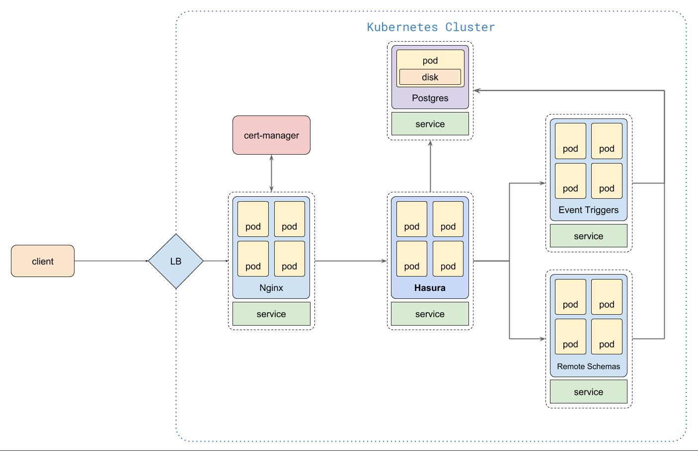

# Kustomize

A feature-complete Hasura stack on Kubernetes.

## Components

- Postgres
- Hasura GraphQL Engine
- Hasura Auth
- Hasura Storage
- Infra Dashboard

## Architecture



### Goals

- Define all sub components into one l*arge declarative* Kubernetes deployment
- Controls the order of deployments
- Maintaine **History** of deployments and able to rollback to specific version.

### Features

- **Multiple environments** - Deploy to multiple environments (dev, test, prod etc.) and/or clusters with different configurations.
- **Configuration and templating** - allows to use templating in nearly all places, making it easy to have dynamic configuration.
- **Diffs and Dry-Runs** - Diffs and dry-runs allow you to always know what will happen and what actually happened.
- **GitOps** - Use a GitOps workflow (Argo CD, Flux CD) for easy rollbacks

## Deployment

deploying with **appctl** and **Kustomize**

### Structure

```
├── infra
│   ├── base
│   │   └── <resource_api_group>
│   │       └── <resource_kind_plural>
│   │           └── <resource_metadata_name>
│   │               ├── kustomization.yaml
│   │               └── <resource_kind_singular>.yaml
│   ├── components
│   │   ├── <descriptive_component_name>
│   │   └── kustomization.yaml
│   └── overlays
│       ├── prod
│       │   └── kustomization.yaml
│       └── staging
│           ├── kustomization.yaml
│           └── patch-replicas.yaml
└── delivery
    └── overlays
        ├── prod.yaml
        └── staging.yaml
```

we can even have multiple levels of nested overlays

e.g., base, overlays, <regions/zones>

#### infra/base

Configuration in the directory `infra/base` applies to all environments. Additional configuration in `infra/overlays` can modify this configuration.

#### infra/components

**components** are _variants_ that we want to apply for specific target environment deployment

#### infra/overlays

> Deploy to multiple environments (dev, test, prod etc.) and/or clusters with different configurations.

The repository contains information on two environments, defined in the directory `infra/overlays` `prod` and `staging`.

The `prod` environment refers only to the configuration in `infra/base/myapp.yaml`.

The `staging` environment has an additional customization in `infra/overlays/staging/patch-replicas.yaml`. This customization is referenced in `infra/overlays/staging/kustomization.yaml`.

#### delivery/overlays

Subdirectories in `delivery/overlays` contain information on the GKE clusters that host each environment. These files are automatically generated and don't need to be modified directly.

### Install

```bash
gcloud components install appctl
```

### Setup

> One time setup

```bash
# Initialize existing repository
# make sure the `git remote -v` show `git@github.com:xmlking/spectacular.git`
cd ..
appctl init spectacular --app-config-repo=github.com/xmlking/spectacular
cd spectacular
# Create the configuration for your Kubernetes workload. i.e., add/update `infra/base`, then test:
# kubectl apply -k infra/base/ --dry-run=client -o yaml
kustomize build infra/base
# if works, add changes to git and commit.
git add .
git commit -m "chore(deploy): bootstraping config"
git push
# 2. add new target and connect to cluster
appctl env add development --cluster=sumo --namespace=development --review-required=false
appctl env add staging --cluster=sumo --namespace=staging --review-required=false
appctl env add production --cluster=sumo --namespace=production --review-required=true
# To see appctl changes, run `git log -p *`.
# push auto-generated configurations
git push
# Create the configuration for your enveronments. i.e., add/update `infra/overlays`, then test, push code.
# dry run to see what you will create
# kubectl apply -k infra/overlays/development  --dry-run=client -o yaml
mkdir -p {./build/kubernetes/local,./build/kubernetes/development,./build/kubernetes/production,./build/kubernetes/staging}
kustomize build infra/overlays/local 				--output ./build/kubernetes/local 			--load-restrictor LoadRestrictionsNone
kustomize build infra/overlays/local 				--output ./build/kubernetes/local 			--load-restrictor LoadRestrictionsNone --namespace local
kustomize build infra/overlays/development 	--output ./build/kubernetes/development --load-restrictor LoadRestrictionsNone
kustomize build infra/overlays/production 	--output ./build/kubernetes/production 	--load-restrictor LoadRestrictionsNone
kustomize build infra/overlays/staging 			--output ./build/kubernetes/staging 		--load-restrictor LoadRestrictionsNone
# tag changes
git tag v0.1.3
git push origin  v0.1.3
# prepare env PR (response with created PR in seymour-env)
appctl prepare development
appctl prepare development --from-tag v0.1.3
# run apply without merge the PR -> deny
appctl apply staging
# merge PR in seymour-env and see created dev branch
# rerun apply
# open GCP and see GKE/Applications
# to promote a release candidate from one environment to another, run the following command:
appctl prepare prod --from-env staging
# to deploy the release candidate to the target environment, run the following command:
appctl apply prod
# rollback
appctl apply development --from-tag v0.1.0
```

## Migrations

## Best Practices

Following are the important points you should know about the `Kustomize`

- Since Kustomize creates a new configmap every time there is an update, you need to **garbage-collect your old orphaned Configmaps**. If you have resource quota limits set for namespace, orphaned Configmaps could be an issue. Or you should use the **–prune** flag with labels in the **kubectl apply** command. Also, GitOps tools like **ArgoCD** offer Orphaned resource monitoring mechanisms.

- You can use the `disableNameSuffixHash: true` flag to disable creating new Configmaps on every update, but it does not trigger a pod rollout. You need to manually trigger a rollout for pods to get the latest configmap data
-

## Reference

1. [kustomize](https://kubectl.docs.kubernetes.io/pages/examples/kustomize.html)
1. <https://github.com/kubernetes-sigs/kustomize/blob/master/docs/glossary.md>
1. <https://blog.jetstack.io/blog/kustomize-cert-manager/>
1. <https://kustomize.io/>
1. with sops <https://teuto.net/deploying-jupyterhub-to-kubernetes-via-kustomize-using-sops-secret-management/?lang=en>
1. <https://github.com/pwittrock-me/petclinic-config/tree/master/config>
1. [TODO: gRPC-Web Istio Demo](https://github.com/venilnoronha/grpc-web-istio-demo)
1. patch example, keycloak traefik <https://github.com/piotrjanik/opa-warsaw-cloud-native-conf/tree/master/manifests>
1. [Application Delivery](https://cloud.google.com/kubernetes-engine/docs/concepts/add-on/application-delivery)
1. [Application Manager for GKE](https://cloud.google.com/blog/products/containers-kubernetes/announcing-application-manager-for-google-kubernetes-engine)
1. [Application Manager brings GitOps to GKE](https://www.youtube.com/watch?v=r5_xYtbZPfc)
1. Kustomize
   1. [Kustomize Cheat Sheet](https://itnext.io/kubernetes-kustomize-cheat-sheet-8e2d31b74d8f)
   2. [ConfigGenerator Patching example](https://elatov.github.io/2021/08/using-kustomize/)

## TODO

1. https://github.com/yrobla/apps/tree/master/cluster-scope
2. Ideas from [nhost-helm](https://github.com/fpoussin/nhost-helm) repo
